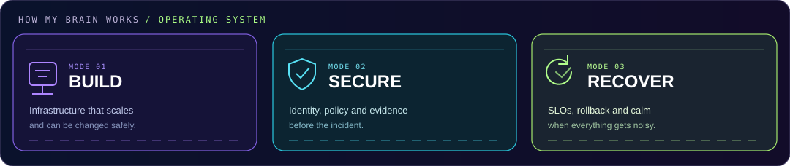
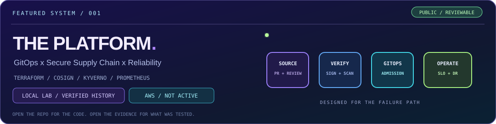

<!-- CONCEPT: FADY // MISSION CONTROL — preview branch, not merged -->

 

 

*My kind of fun? Turning "it works on my machine" into "we can deploy it, secure it and recover it."* ☕

<!-- 2 x 2 layout keeps link labels and individual animated icons legible at GitHub's README width. -->
<table>
  <tr>
    <td width="50%"></td>
    <td width="50%"></td>
  </tr>
  <tr>
    <td width="50%"></td>
    <td width="50%"></td>
  </tr>
</table>

 

<!-- Original animated GIF is unchanged and stays visible. The old dark pipeline illustration
     remains preserved as an asset in the repo, but isn't shown in this Option A layout. -->

 

Me, when the logs finally make sense. 😎

---

---

### `01 // THE MAIN QUEST` &nbsp; 🚀

**[See the architecture](https://fadyy2k.github.io/platform-engineering-eks-gitops/)** &nbsp; · &nbsp; **[View real test evidence](https://fadyy2k.github.io/platform-engineering-eks-gitops/LOCAL_RUNTIME/)** &nbsp; · &nbsp; **[Explore v0.7.1](https://github.com/fadyy2k/platform-engineering-eks-gitops/releases/tag/v0.7.1)**

✓ Historical local Kubernetes runtime tests and public CI &nbsp; / &nbsp; ⏳ AWS provisioning not performed. The temporary local lab was removed after testing.

---

### `02 // SIDE QUESTS` &nbsp; 🕹️

<table>
  <tr>
    <td width="33%"></td>
    <td width="33%"></td>
    <td width="34%"></td>
  </tr>
</table>

**Also on the bench:** [DevSecOps visual showcase](https://github.com/fadyy2k/depi-devsecops-showcase) &nbsp; · &nbsp; [Engineering lab roadmap](https://github.com/users/fadyy2k/projects/2)

---

**[06 case studies](https://github.com/fadyy2k/engineering-case-studies)** &nbsp; ◆ &nbsp; **[Engineering delivery board](https://github.com/users/fadyy2k/projects/1)** &nbsp; ◆ &nbsp; **UPSTREAM:** [OpenCost #386](https://github.com/opencost/opencost-helm-chart/pull/386) · [Kyverno #2175](https://github.com/kyverno/website/pull/2175)

Upstream pull requests were submitted; their acceptance status is maintained on GitHub.

---

**BEYOND THE RACK** &nbsp; // &nbsp; VMware · Proxmox · OCI · Jenkins · Bash · Nginx · SQL Server · FortiGate · Microsoft Defender · CodeQL · Gitleaks · Cosign · Kyverno · Falco · Trivy · Tailscale

**CREDENTIALS** &nbsp; // &nbsp; Microsoft SC-100 / SC-200 · AWS SAA-C03 / CLF-C02 · Cisco CCNA / CyberOps · IBM cloud tracks · Google IT Support &nbsp; ↗ &nbsp; [Verified credentials](https://www.credly.com/users/fady-mounir-zaghloul)

**THE OPERATOR** &nbsp; // &nbsp; 12+ years across infrastructure, operations and security. Keeping business systems dependable, and publishing testable engineering evidence. &nbsp; ↗ &nbsp; [Engineering delivery](https://github.com/users/fadyy2k/projects/1)

---

### `05 // STILL SHIPPING`

**[Portfolio](https://fadyy2k.github.io/portfolio/) &nbsp; / &nbsp; [Let's connect](https://www.linkedin.com/in/fady-mounir-601331b6/) &nbsp; / &nbsp; [See the work](https://github.com/fadyy2k?tab=repositories)**

