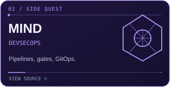
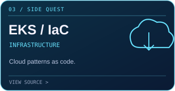
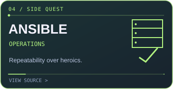

<!-- CONCEPT: FADY // MISSION CONTROL — preview branch, not merged -->

 

 

*My kind of fun? Turning "it works on my machine" into "we can deploy it, secure it and recover it."* ☕

 

<!-- Original animated GIF is unchanged and stays visible. The old dark pipeline illustration
     remains preserved as an asset in the repo, but isn't shown in this Option A layout. -->

 

Me, when the logs finally make sense. 😎

---

### ⚡ HOW MY BRAIN WORKS

---

### `01 // THE MAIN QUEST` &nbsp; 🚀

**[See the architecture](https://fadyy2k.github.io/platform-engineering-eks-gitops/)** &nbsp; · &nbsp; **[View real test evidence](https://fadyy2k.github.io/platform-engineering-eks-gitops/LOCAL_RUNTIME/)** &nbsp; · &nbsp; **[Explore v0.7.1](https://github.com/fadyy2k/platform-engineering-eks-gitops/releases/tag/v0.7.1)**

✓ Historical local Kubernetes runtime tests and public CI &nbsp; / &nbsp; ⏳ AWS provisioning not performed. The temporary local lab was removed after testing.

---

### `02 // SIDE QUESTS` &nbsp; 🕹️

<table>
  <tr>
    <td width="33%"></td>
    <td width="33%"></td>
    <td width="34%"></td>
  </tr>
</table>

**Also on the bench:** [DevSecOps visual showcase](https://github.com/fadyy2k/depi-devsecops-showcase) &nbsp; · &nbsp; [Engineering lab roadmap](https://github.com/users/fadyy2k/projects/2)

---

### `03 // THE WORK BEHIND THE WORK` &nbsp; 🎯

**From real operations** &nbsp; → &nbsp; [SaaS architecture](https://github.com/fadyy2k/engineering-case-studies/blob/main/case-studies/01-multi-tenant-saas-platform.md) · [PostgreSQL replication](https://github.com/fadyy2k/engineering-case-studies/blob/main/case-studies/02-cross-site-postgresql-replication.md) · [Rollback-first migration](https://github.com/fadyy2k/engineering-case-studies/blob/main/case-studies/03-cloud-migration-with-rollback.md) · [Observability](https://github.com/fadyy2k/engineering-case-studies/blob/main/case-studies/04-observability-baseline.md) · [Identity hardening](https://github.com/fadyy2k/engineering-case-studies/blob/main/case-studies/05-identity-security-hardening.md) · [Local-first AI](https://github.com/fadyy2k/engineering-case-studies/blob/main/case-studies/06-local-first-ai-platform.md)

**Working in the open** &nbsp; → &nbsp; [OpenCost Helm PR #386](https://github.com/opencost/opencost-helm-chart/pull/386) · [Kyverno docs PR #2175](https://github.com/kyverno/website/pull/2175) (submitted; see GitHub for current review status)

---

### `04 // INVENTORY` &nbsp; 🔧

<b>🗃️ Open the rest of the toolbox, certifications and career details</b>

**More of my stack:** VMware · Proxmox · OCI · Jenkins · Bash · Nginx · SQL Server · FortiGate · Microsoft Defender · CodeQL · Gitleaks · Cosign · Kyverno · Falco · Trivy · Tailscale

**Selected credentials:** Microsoft SC-100 + SC-200 · AWS SAA-C03 + CLF-C02 · Cisco CCNA / CyberOps · IBM cloud tracks · Google IT Support

**Career angle:** 12+ years across infrastructure, operations and security. My day job is keeping business systems dependable; my public projects show how I think, test and improve.

[All credentials on Credly](https://www.credly.com/users/fady-mounir-zaghloul) &nbsp; · &nbsp; [Selected engineering delivery](https://github.com/users/fadyy2k/projects/1)

---

### `05 // STILL SHIPPING`

**[Portfolio](https://fadyy2k.github.io/portfolio/) &nbsp; / &nbsp; [Let's connect](https://www.linkedin.com/in/fady-mounir-601331b6/) &nbsp; / &nbsp; [See the work](https://github.com/fadyy2k?tab=repositories)**

