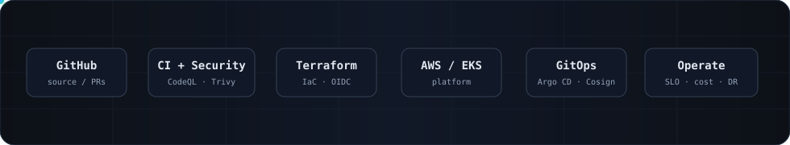

<div align="center">





[](https://git.io/typing-svg)

[](https://fadyy2k.github.io/portfolio/)
[](https://github.com/fadyy2k/engineering-case-studies)
[](https://github.com/users/fadyy2k/projects/1)
[](https://github.com/users/fadyy2k/projects/2)
[](https://www.linkedin.com/in/fady-mounir-601331b6/)
[](https://www.credly.com/users/fady-mounir-zaghloul)

</div>

---

## `whoami`

```yaml
name: Fady Mounir Zaghloul
current_role: IT & Security Manager @ AsusCard FinTech
location: Cairo, Egypt
experience: 12+ years across infrastructure, cloud, operations and security

engineering_focus:
  - platform and infrastructure engineering
  - cloud architecture and migration
  - DevSecOps and software supply-chain security
  - observability, SLOs and operational reliability
  - identity, endpoint and infrastructure security

open_to:
  - Infrastructure / Platform Lead
  - Cloud / Platform Engineer
  - DevOps / SRE
  - Security Architecture / Operations
```

## 🧭 Engineering principles

- **Rollback is a feature.** A deployment path is incomplete until the known-good recovery path is documented and tested.
- **Identity before static credentials.** Prefer short-lived OIDC/workload identity and least privilege over stored cloud keys.
- **Security belongs in delivery.** Scan source/configuration, generate provenance/SBOM, sign artifacts, then enforce policy at admission/runtime.
- **Operate from signals.** SLOs, error budgets, runbooks and recovery tests matter more than decorative dashboards.
- **Public evidence ≠ public infrastructure.** Production write-ups are sanitized; credentials, live endpoints, private network plans and customer data stay private.

---

## 🚀 Current flagship — AWS EKS Platform Engineering

<a href="https://github.com/fadyy2k/platform-engineering-eks-gitops">
  
</a>

A production-style public reference implementation that now covers:

`Terraform` · `AWS EKS` · `GitHub OIDC` · `Argo CD` · `Cosign` · `Kyverno` · `Falco` · `Trivy Operator` · `Prometheus/Grafana` · `SLOs` · `OpenCost` · `VPA recommendations` · `backup/game-day patterns` · `DR architecture`

- Seven staged engineering releases from baseline through live-readiness and local runtime evidence
- protected `main`, required security checks and signed commits
- project-owned container supply chain with provenance, SBOM, scanning and keyless signing
- policy/runtime security, reliability and cost controls separated into reviewable layers
- real Kubernetes 1.36 local runtime evidence: Argo CD, Kyverno admission, Prometheus/SLOs, Trivy, Falco, VPA, OpenCost and a controlled recovery game day
- live-cloud activation deliberately kept explicit rather than pretending unprovisioned infrastructure is running

**→ [Documentation](https://fadyy2k.github.io/platform-engineering-eks-gitops/) · [Local Runtime Evidence](https://fadyy2k.github.io/platform-engineering-eks-gitops/LOCAL_RUNTIME/) · [Repository](https://github.com/fadyy2k/platform-engineering-eks-gitops) · [v0.7.0](https://github.com/fadyy2k/platform-engineering-eks-gitops/releases/tag/v0.7.0)**

---

## 🏗️ Sanitized production engineering

Long-form production details no longer live in this profile. They are separated into sanitized case studies so the engineering decisions are public without publishing a real environment's attack surface.

| Pattern | Focus |
| --- | --- |
| [Multi-tenant SaaS platform](https://github.com/fadyy2k/engineering-case-studies/blob/main/case-studies/01-multi-tenant-saas-platform.md) | isolation, releases, backups, observability, capacity |
| [Cross-site PostgreSQL replication](https://github.com/fadyy2k/engineering-case-studies/blob/main/case-studies/02-cross-site-postgresql-replication.md) | private connectivity, replication health, rollback |
| [Cloud migration with rollback](https://github.com/fadyy2k/engineering-case-studies/blob/main/case-studies/03-cloud-migration-with-rollback.md) | replication-first cutover, DNS, failback |
| [Observability baseline](https://github.com/fadyy2k/engineering-case-studies/blob/main/case-studies/04-observability-baseline.md) | signals, alerts, runbooks |
| [Identity hardening](https://github.com/fadyy2k/engineering-case-studies/blob/main/case-studies/05-identity-security-hardening.md) | MFA, mail security, DLP, rollout safety |
| [Local-first internal AI](https://github.com/fadyy2k/engineering-case-studies/blob/main/case-studies/06-local-first-ai-platform.md) | data boundaries, RBAC, RAG, plugin/network risk |

**→ [Engineering Case Studies](https://github.com/fadyy2k/engineering-case-studies)**

---

## 🧰 Engineering stack

<details>
<summary><b>Cloud, platform, automation and security</b></summary>

### Cloud / Infrastructure
`AWS` · `OCI` · `Linux` · `Terraform` · `Kubernetes / EKS / K3s` · `Argo CD` · `Nginx` · `Proxmox` · `VMware`

### Delivery / Automation
`GitHub Actions` · `Jenkins` · `Docker / BuildKit` · `Ansible` · `Bash` · `Python` · `PM2`

### Security
`Microsoft Defender` · `FortiGate` · `CodeQL` · `Gitleaks` · `Trivy` · `Cosign` · `Kyverno` · `Falco` · `Tailscale`

### Observability / Reliability
`Prometheus` · `Grafana` · `SLO / error-budget alerts` · `OpenCost` · `game-day / recovery testing`

### Data / Application
`PostgreSQL` · `MySQL / MariaDB` · `SQL Server` · `Redis` · `Node.js` · `NestJS` · `FastAPI` · `.NET`

</details>

---

## 🏅 Credentials

<details>
<summary><b>Selected certifications and training</b></summary>

| Vendor | Selected credentials |
| --- | --- |
| Microsoft | **SC-100** Cybersecurity Architect Expert · **SC-200** Security Operations Analyst |
| AWS | **SAA-C03** Solutions Architect Associate · **CLF-C02** Cloud Practitioner |
| Cisco | **CCNA** · **CyberOps Associate** |
| IBM | Cloud Professional Architect · Cloud SRE · SkillsBuild Cybersecurity |
| Google | IT Support Professional · Security in Google Cloud |
| NTI / MCIT | DEPI Cisco Cybersecurity Engineer · Post Graduate Diploma AI & Modern Technologies |

**30+ verifiable credentials → [Credly](https://www.credly.com/users/fady-mounir-zaghloul)**

</details>

---

## 🔬 Featured engineering repositories

<div align="center">

<a href="https://github.com/fadyy2k/platform-engineering-eks-gitops"></a>
<a href="https://github.com/fadyy2k/depi-mind-app-v2"></a>
<a href="https://github.com/fadyy2k/depi-helloapp-infra-v2"></a>

<a href="https://github.com/fadyy2k/notesapp-multi-ec2-ansible"></a>
<a href="https://github.com/fadyy2k/depi-devsecops-showcase"></a>
<a href="https://github.com/fadyy2k/engineering-case-studies"></a>

</div>

---

## 📊 GitHub activity

<div align="center">


<br/><br/>


</div>

---

<div align="center">


*Build for the failure path. Document the recovery path.*
</div>
